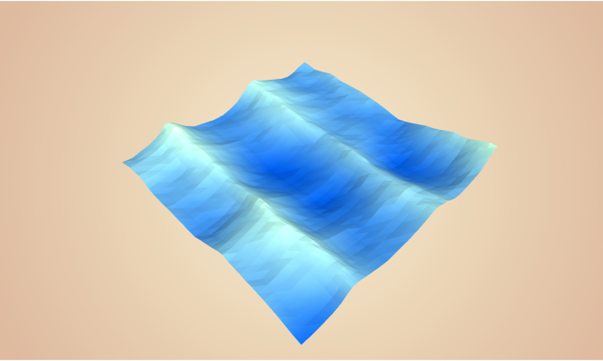

  <h3 align="center">🌊</h3>
  <h1 align="center">Stylized Ocean</h1>
  
  

    Generating small to large scale procedural oceans on the GPU using Gerstner Waves.
     
    <a href="https://blog.farazshaikh.com/stories/generating-a-stylized-ocean/">Read the article</a>
  

 

    </img>

 
