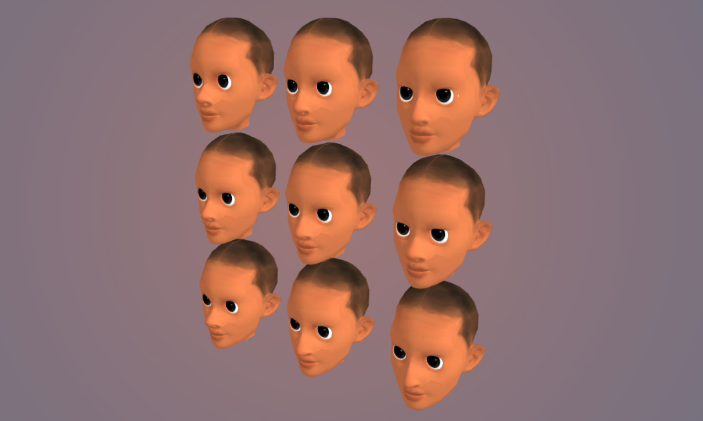

  <h3 align="center">👤</h3>
  <h1 align="center">Randomized Chanracters</h1>
  
  

    Generating randomized characters using Shape keys and Morph targets.
     
    <a href="https://blog.farazshaikh.com/stories/character-creation-in-three-js/">Read the article</a>
  

 

    </img>

 
